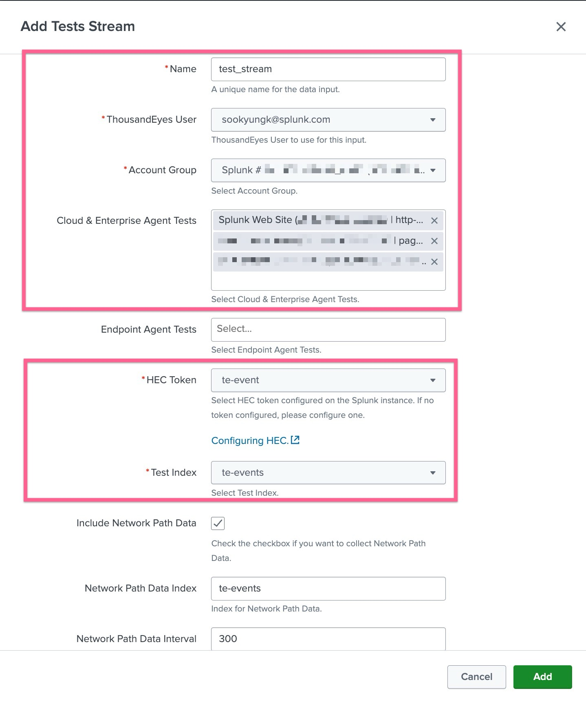

**Table of Contents**

- [Requirements](#requirements)
- [1. Data Input (Core)](#1-data-input-core)
  - [1-1. Install TE App](#1-1-install-te-app)
  - [1-2. Add TE account](#1-2-add-te-account)
  - [1-3. HEC 준비하기](#1-3-hec-준비하기)
  - [1-4. Thousand Eyes integration 생성하기](#1-4-thousand-eyes-integration-생성하기)
  - [1-5.Test Stream 설정하기](#1-5test-stream-설정하기)
- [2. Content Pack (ITSI)](#2-content-pack-itsi)
  - [2-1. Install TE Content pack](#2-1-install-te-content-pack)
  - [2-2. 콘텐츠팩인 올바른 인덱스를 사용하는지 확인](#2-2-콘텐츠팩인-올바른-인덱스를-사용하는지-확인)
- [참조](#참조)

# Requirements

- [ ] ITSI 프리미엄 앱이 설치 되어 있어야 합니다 (ITSI content pack 사용 시)
- [ ] Thousand Eyes 계정이 있으며, 생성 된 테스트가 하나 이상 있어야합니다
- [ ] 연동할 Splunk Cloud 가 443 포트로 외부와 통신이 가능해야합니다
- [ ] Splunk Enterprise 가 8088 포트로 외부와 통신이 가능해야 합니다
- [ ] Splunk Enterprise 인 경우 CA 에서 발급받은 인증서를 통해 SSL 통신이 가능해야합니다

# 1. Data Input (Core)

## 1-1. Install TE App

Thousand Eyes 연동을 위해서는 앱 설치 및 계정연동이 필요합니다. **Apps > Find More Apps** 메뉴에서 아래와 같이 Thousand Eyes 앱을 찾아 설치를 진행합니다.

## 1-2. Add TE account

Thousand Eyes 계정을 연결하기 위해 앱으로 들어 간 후 Configuration 메뉴에서 ThousandEyes User 탭에 [Add] 버튼을 클릭합니다.
아래와 같은 창이 뜨는데

- [Authorize] 버튼을 눌러 로그인을 수행합니다
  
- 사용자 코드를 확인하고 Verify 를 클릭합니다
  
- 로그인을 진행합니다
- 성공적으로 로그인 후 동의를 제공합니다
  
- Splunk 화면에서 [Add] 를 눌러 저장합니다

## 1-3. HEC 준비하기

데이터를 받을 인덱스를 생성하고 해당 인덱스로 데이터를 넣을 수 있도록 HEC 생성 및 토큰을 기록합니다.

## 1-4. Thousand Eyes integration 생성하기

Thousand Eyes UI 에서 **Manage > Integration > Integration 2.0** 탭으로 이동합니다.
[New Connector] 버튼을 눌러 연결을 생성합니다.

- Splunk Cloud / Enterprise 를 선택합니다
- Name : 식별할 수 있는 커넥터 이름 지정
- Target : HEC endpoint 를 지정
- Token : HEC 토큰 지정
- save 를 눌러 저장합니다

여기 생성된 Connector에 "Assigned Operations" 컬럼을 보면 아무것도 지정되지 않았다는 표시가 뜹니다.
[Manage] 버튼을 누르고 새로운 operation을 생성합니다.

- Operation Name : 이름을 지정합니다
- Index : Splunk의 어떤 인덱스로 이벤트를 보낼 것인지 지정합니다
- Source / SourceType : 적당히 지정합니다
- Test Data Configuration : 데이터를 보낼 테스트를 지정합니다
- 하단에 있는 Test 버튼을 눌러 성공적으로 스플렁크와 연결이 되는지 확인합니다.
- Save를 눌러 저장합니다

## 1-5.Test Stream 설정하기

Splunk 의 Thousand Eyes 앱에서 Input을 설정하여 데이터를 받아 올 수 있도록 설정합니다.

# 2. Content Pack (ITSI)

Thousand Eyes 콘텐츠팩을 설치하고 데이터가 올바로 유입되는지 확인합니다.

## 2-1. Install TE Content pack

스플렁크 화면에서 **ITSI > Configuration > Data Integrations** 메뉴로 이동합니다.
Content Library 탭에서 Cisco Thousand Eyes 콘텐츠팩을 선택하여 설치합니다

설치 옵션 화면에서 아래 부분이 모두 선택이 되었는지 확인합니다.

- [ ] 콘텐츠팩의 모든 요소를 선택합니다
- [ ] Import as enabled 를 활성화 시킵니다
- [ ] Activate All saved search 를 선택합니다

## 2-2. 콘텐츠팩인 올바른 인덱스를 사용하는지 확인

Cisco ThousandEyes용 콘텐츠 팩은 검색 매크로를 사용하여 모든 검색이 동일한 인덱스를 사용하도록 합니다. 검색 매크로는 Cisco ThousandEyes App for Splunk가 데이터를 수집하는 데 사용하는 것과 동일한 인덱스를 사용하도록 구성해야 합니다.

> [!Caution]
> TE Content Pack 이 쓰는 인덱스와 TE App 이 쓰는 인덱스가 같아야합니다

인덱스를 확인하는 방법은 아래와 같습니다.
**Settings > Advanced Search > Search Macro** 메뉴로 이동하여 App 구분을 **Cisco ThousandEyes(DA-ITSI-CP-thousandeyes)** 를 선택합니다

출력되는 항목 중 "itsi_cp_thousandeyes_index" 항목을 찾아 지정 된 인덱스의 이름을 확인합니다.

이제는 **Thousand Eyes App** 으로 이동하여 Input 탭에 지정 된 인풋을 확인합니다.
연필모양 버튼을 눌러 지정 된 인덱스의 이름을 확인합니다

두 설정 모두 같은 인덱스를 가리키고 있나요? 확인합시다

# 참조

| 이름                                                    | 링크                                                                                                                                         |
| ------------------------------------------------------- | -------------------------------------------------------------------------------------------------------------------------------------------- |
| Configuring ThousandEyes for Splunk Cloud or Enterprise | https://docs.thousandeyes.com/product-documentation/integration-guides/custom-built-integrations/opentelemetry/configure-splunk-integrations |
| Cisco Thousand Eyes App for Splunk                      | https://docs.thousandeyes.com/product-documentation/integration-guides/custom-built-integrations/splunk-app                                  |
| Install the Content Pack for Cisco ThousandEyes         | https://docs.splunk.com/Documentation/CPThousandEyes/1.0.0/CP/Install                                                                        |
